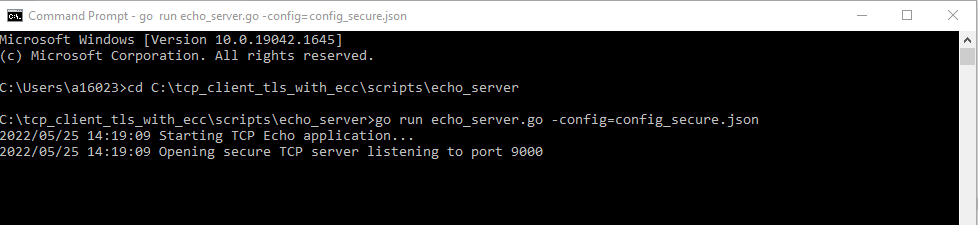
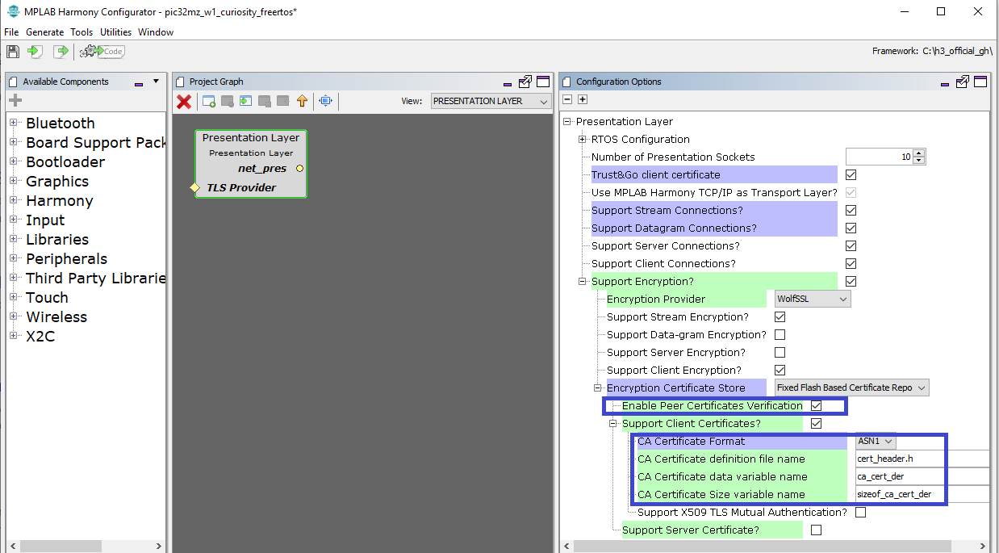

# Secured TCP Client with ECC608 TNG Crypto Coprocessor 


> "Wireless Made Easy!" - This example example application acts as a TCP Client to connect to Secured TCP Server with ECC608 TNG crytpo coprocessor and exchange data 

Devices: **WFI32E01**

## ⚠ Disclaimer

<p><span style="color:red"><b>
THE SOFTWARE ARE PROVIDED "AS IS" AND GIVE A PATH FOR SELF-SUPPORT AND SELF-MAINTENANCE.</br></br>
This repository contains unsupported example code intended to help accelerate client product development. It is not validated for production nor audited for security best-practices.</br></br>
Note that while this repository is unsupported, Microchip welcome community contributions, and all pull-requests will be considered for inclusion into the repository.
</span></p></b>

> Interact with peers in the community at [WiFi Forum](https://www.microchip.com/forums/f545.aspx).

## Description

This application demonstrates how WFI32E01 can act as a TCP client to connect to a TLS TCP server with the onboard ECC608 TNG crypto chip. ECC Chiper Suites are used in the secure connection. ECC608 employs ultra-secure hardware-based key storage which prevent the physical attack and eliminate potential backdoors linked to software weaknesses. The stored keys in ECC608 work with TLS protocol for authentication, encryption and integrity.

The user would need to configure the Wi-Fi credentials for the Home AP and the TLS server details. Golang scripts are used to set up a TLS echo server in your computer. WFI32 device connect to the TLS echo server to send and receive the message "Hello World!".
<p align="center">

</p>

## Software requirement

The sample project has been created and tested with the following Software Development Tools:
- [MPLAB X IDE v6.00](https://www.microchip.com/en-us/tools-resources/develop/mplab-x-ide)
- [MPLAB XC32 v3.00](https://www.microchip.com/en-us/tools-resources/develop/mplab-xc-compilers)
- MPLAB Harmony v3.6.4
   - mhc v3.8.2
   - csp v3.10.0
   - core v3.10.0
   - wireless_wifi v3.6.1
   - dev_packs v3.10.0
   - wireless_system_pic32mzw1_wfi32e01 v3.6.1
   - wolfssl v4.7.0
   - net v3.7.4
   - crypto v3.7.4
   - CMSIS-FreeRTOS v10.3.1


Download and install a serial terminal program like [TeraTerm](https://osdn.net/projects/ttssh2/releases/). Launch TeraTerm program and configure the serial ports mounted with: **115200 bps, 8 N 1**

## Downloading and building the application

To download or clone this application from Github


Path of the application within the repository is **/firmware** .

To build the application, refer to the following table and open the project using its IDE.

| Project Name      | Description                                    |
| ----------------- | ---------------------------------------------- |
| pic32mz_w1_curiosity_freertos.X | MPLABX project for PIC32MZ W1 Curiosity Board or WFI32-IoT Board|
|||

## Setting up PIC32MZ W1 Curiosity Board/ WFI32-IoT Board

### WFI32-IoT Board
- Connect the WFI32-IoT board to a PC using a standard micro-USB cable.
- When connecting WFI32-IoT board to a PC, two virtual COM ports are formed, UART1 print the application log

### Curiosity Board
- Connect the Debug USB port on the board to the computer using a micro USB cable
- On the GPIO Header (J207), connect U1RX (PIN 13) and U1TX (PIN 23) to TX and RX pin of any USB to UART converter
- Home AP (Wi-Fi Access Point with internet connection)

## Setting up TLS echo server
Golang scripts are used to set up a TLS echo server running on your computer. The demo project connect PIC32MZW1 device to the TLS echo server to send and receive the message "Hello World!".

### Prequisites
Install Golang tool from this [link](https://go.dev/doc/install)

### Steps
1. Get the device certificate of PIC32MZW1 module. 
    - Browse to and open the project  
        tng_certificate_reader\firmware\tng_certificate_reader.X.  
    - Rebuild your project.  
    - On the Projects tab, right-click the tng_certificate_reader top-level folder, and then choose **Run**  
    - Connect WFI32-IoT board to a PC using a standard micro-USB cable/ Connect the Curiosity Board’s debug USB (J302) to your PC, it enumerates as a USB MSD (Mass Storage Device)
    - You can browser the USB device and copy the ".cer" file to the directory scripts/echo_server/certs/
    - Rename ".cer" file name to "client.cer"
2. Run below command to launch the TLS echo server   
    `go run echo_server.go -config=config_secure.json`  
    

### Optional steps
The server certificate is already generated and stored in scripts/echo_server/certs/, if you want to regenerate the server certificate, you can use below command with the tool "openssl":
```bash
openssl req -new -x509 -nodes -newkey ec:<(openssl ecparam -name prime256v1) -keyout certs/server.key -out certs/server.pem -days 365 -subj "/C=US/ST=WA/L=Place/O=YourCompany/OU=IT/CN=www.your-company-website.com/emailAddress=yourEmail@your-company-website.com"
```
After server.key and server.pem are generated, you can replace the original files in scripts/echo_server/certs/.   
You also need to convert server.pem to C header file and and replace the firmware/src/cert_header.h    
You can use the tool [CryptoHeaderGen](https://vppillai.github.io/cryptoScript/CryptoHeaderGen.html) to do this.

## Running the Application

1. Open the project and launch Harmony3 configurator.
2.	Configure home AP credentials for STA Mode.


3. Currently Net Service is configured to run a TCP Client in Secured mode to connect to the TLS echo server on the https port (9000). You should need to change the **IP Address** according to the TLS server IP Address (Your PC IP Address). Also ensure **Trust&Go client certificate** is enabled to work with ECC608 TNG crypto chip. Please make the changes in the Net Service Module configurations as shown below:  


4.	Save configurations and generate code via MHC 
5.	Build and program the generated code into the hardware using its IDE
6. Open the Terminal application (Ex.:Tera term) on the computer
7. Connect to the "USB to UART" COM port and configure the serial settings as follows:
    - Baud : 115200
    - Data : 8 Bits
    - Parity : None
    - Stop : 1 Bit
    - Flow Control : None

8.	The device will connect to the Home AP and print the IP address obtained.

9.	The Board will connect to Home AP and then as per the default Net Service configuration, it shall connect to TLS echo server and do data exchange:


    TLS echo server show below log on PC:  
    

## Other Hightlights

1. In the project graph, below modules are the ECC608 TNG crypto chip related compontents which already be added to the project:


2. In wolfCrypto Module, ECC Cipher is enable while RSA Cipher is disable in the configuration settings:


3. In Presentation Layer module, Peer Certificates Verification is enable for TLS authenication to incrase the security level. CA Certificate is also defined.


4. In the Golang TLS echo server, tls.RequireAndVerifyClientCert is defined in scripts/echo_server/echo_server.go to enable mutual authentication to increase the security level.


5. Wireshark capture analysis

    Below picture show the wireshark capture for the demo. The secure connection is work with TLS v1.3. You can see the cipher suites supported by PIC32MZW1 module (IP: 172.20.10.2) are ECC chiper suties only. The full capture file can be found in  packet_capture/tls_1_3_wireshark_capture.pcapng  

    

    As all handshake messages of TLS1.3 after the ServerHello are encrypted, TLS v1.2 is also tested to show the mutual authenication process. Both client and server send the certificate to the peer for authenication. PIC32MZW1 module's IP is 172.20.10.2 while PC IP is 172.20.10.12.  
    The full capture file can be found in  packet_capture/tls_1_2_wireshark_capture.pcapng  

    